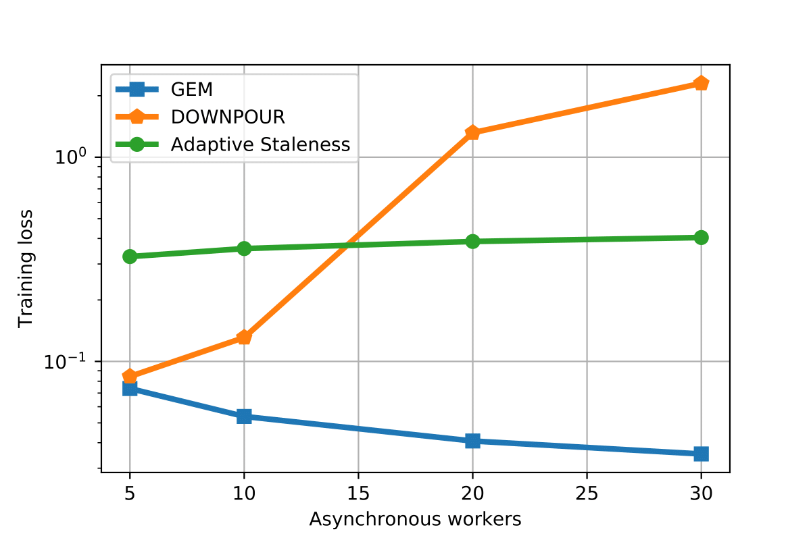
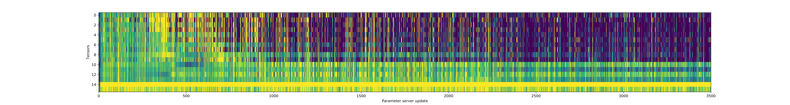
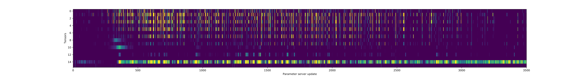
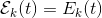
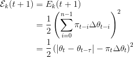
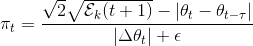

# Gradient Energy Matching

Repository for the paper on Gradient Energy Matching (GEM).

<p align="center">

</p>




## Abstract

Distributed asynchronous SGD has become widely used for deep learning in large-scale systems, but remains notorious for its instability when increasing the number of workers. In this work, we study the dynamics of distributed asynchronous SGD under the lens of Lagrangian mechanics. Using this description, we introduce the concept of energy to describe the optimization process and derive a sufficient condition ensuring its stability as long as the collective energy induced by the active workers remains below the energy of a target synchronous process. Making use of this criterion, we derive a stable distributed asynchronous optimization procedure, GEM, that estimates and maintains the energy of the asynchronous system below or equal to the energy of sequential SGD with momentum.
Experimental results highlight the stability and speedup of GEM compared to existing schemes, even when scaling to one hundred asynchronous workers. Results also indicate better generalization compared to the targeted SGD with momentum.

## tl;dr

1. We formulate stochastic gradient descent in the context of Lagrangian mechanics and derivea sufficient condition for ensuring the stability of a distributed asynchronous system.

2. Building upon this framework, we propose a variant of distributed asynchronous SGD, GEM, that views the set of active workers as a whole and adjusts individual worker updates in order to match the dynamics of a target synchronous process.

3. The target synchronous process in this work, i.e. the proxy, is regular momentum SGD.

4. This allows us to define a *compliance* condition using the kinetic energy of the proxy and the central variable respectively:
   <p align="center">
   
   </p>

5. For a worker to *match* the energy of the proxy, the individual contributions have to be rescaled:
   <p align="center">
   
   </p>

6. Solving for the rescaling factor (pi) yields
   <p align="center">
   
   </p>

## Code

### Requirements

```shell
conda install pytorch torchvision -c pytorch
```

### Want to try the code?

Just run:

```shell
sh train.sh [num-workers]
```

## FAQ

TODO

## Known issues

### torch.distributed.recv (without a specified rank) is unfair

During our multi-machine experiments we identified an issue with PyTorch's torch.distributed.recv call when *not* specifying a rank. What was happening was that only the workers which have a lower rank (e.g., 1 - 5) where committing to the parameter server, while other workers were actually idle waiting to commit their gradients to the parameter servers. We pinpointed the issue to https://github.com/pytorch/pytorch/blob/master/torch/lib/THD/base/data_channels/DataChannelTCP.cpp#L573 which basically polls the worker sockets sequentially. As a result, the workers with lower ranks are prioritized which results in the fact that commits from other workers are ignored.

We solved this issue by allocating a UDP socket at the parameter server https://github.com/montefiore-ai/gradient-energy-matching/blob/master/code/gem.py#L168 which listens for incoming messages from worker which completed their gradient computations. These messages are queued, and processed *fairly* by the parameter server.

---

Please cite us using the following BibTex entry:

```
TODO
```
